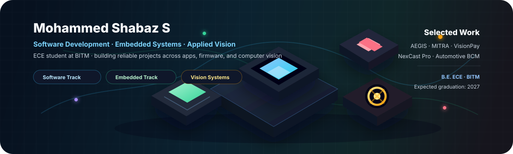

<!-- Profile banner -->
<p align="center">
  
</p>

<p align="center">
  <a href="https://github.com/MdShabazS">
    
  </a>
</p>

<p align="center">
  
  
  
  <a href="https://github.com/MdShabazS">
    
  </a>
</p>

---

## 👋 About

```ts
const shabaz = {
  name: "Mohammed Shabaz S",
  current: "B.E. Electronics & Communication Engineering, BITM",
  semester: "7th Semester",
  expectedGraduation: 2027,
  targetRoles: [
    "Software Engineer / Software Developer",
    "Embedded Engineer"
  ],
  placementFocus: ["Java", "DSA", "SQL", "DBMS", "OS", "CN", "Aptitude"],
  coreStrengths: ["C", "C++", "Embedded C", "Python", "practical project building"],
  learningNow: ["Java", "DSA", "DBMS", "Operating Systems", "SQL"],
};
```

I am preparing for software placements while continuing to build embedded and application-side systems. My portfolio includes Android app work, firmware projects, computer-vision prototypes, and architecture design for emergency-response workflows.

---

## 🧭 Current Direction

<table>
  <tr>
    <td width="33%" valign="top">
      <h3>Software Track</h3>
      <p>Primary placement-preparation focus: Java, DSA, SQL, DBMS, OS, Computer Networks, aptitude, Git/GitHub, and project explanation.</p>
    </td>
    <td width="33%" valign="top">
      <h3>Embedded Track</h3>
      <p>Parallel opportunity area with hands-on work in Embedded C, ESP32, STM32CubeIDE, STM32 HAL, Arduino IDE, sensors, OLEDs, and event-loop design.</p>
    </td>
    <td width="33%" valign="top">
      <h3>AI / Vision Exposure</h3>
      <p>Project-level exposure through OpenCV, TensorFlow Lite, MobileNetV2, YOLO / Ultralytics exposure, image processing, and real-time inference workflows.</p>
    </td>
  </tr>
</table>

---

## 🛠️ Skills & Tools

<p align="center">
  <a href="https://skillicons.dev">
    
  </a>
</p>

<p align="center">
  
  
  
  
  
  
  
  
  
  
  
  
</p>

---

## 🚀 Portfolio Highlights

<table>
  <tr>
    <td width="50%" valign="top">
      <h3>AEGIS</h3>
      <p><b>Role:</b> Team Lead · Original idea · Architecture/design stage</p>
      <p>Emergency-response platform concept with SOS/incident reporting, AI-assisted risk analysis, human dispatcher verification, resource selection, live tracking, case records, and post-incident analytics.</p>
      <p><sub><b>Boundary:</b> architecture/design only; code and hardware are not finalized yet.</sub></p>
    </td>
    <td width="50%" valign="top">
      <h3>MITRA</h3>
      <p><b>iHelp Robotics internship project</b></p>
      <p>Assistive technology project focused on improving guidance and accessibility for blind and low-vision users. I contributed to the Android/app-side experience while the broader system continues under development.</p>
      <p><sub><b>Note:</b> keeping implementation details high-level while the project is still active.</sub></p>
    </td>
  </tr>
  <tr>
    <td width="50%" valign="top">
      <h3>Skin Disease Classification</h3>
      <p><b>IEEE EMBS Pune Section internship · Team of 3</b></p>
      <p>Completed demo-level prototype. Contributed to model selection, model training, evaluation, Python coding, image processing, UI/application work, and testing.</p>
      <p><sub><b>Boundary:</b> exact model is not currently verified; not represented as productized.</sub></p>
    </td>
    <td width="50%" valign="top">
      <h3><a href="https://github.com/MdShabazS/NexCast_Pro">NexCast Pro</a></h3>
      <p><b>Individual internship project</b></p>
      <p>Floor-plan projection system using Python, Flask, OpenCV, Tesseract OCR, pdf2image/Poppler, pygame, REST APIs, and JSON configuration. Supports PDF/image/DXF/DWG ingest, auto-crop, wall/door-related CV processing, OCR, and 1-12 projector zone layouts.</p>
    </td>
  </tr>
  <tr>
    <td width="50%" valign="top">
      <h3><a href="https://github.com/MdShabazS/visionpay">VisionPay</a></h3>
      <p><b>Personal / individual project</b></p>
      <p>Real-time Indian currency denomination detection with spoken feedback for visually impaired users. Uses MobileNetV2, TensorFlow Lite, OpenCV/webcam inference, TTS, confidence/margin gating, temporal smoothing, background class, and auto-count mode.</p>
      <p><sub>Reported validation accuracy: approximately 93% from project description.</sub></p>
    </td>
    <td width="50%" valign="top">
      <h3><a href="https://github.com/MdShabazS/Automotive-Body-Control-Module-ESP32">Automotive BCM</a></h3>
      <p><b>Personal / individual embedded project · ESP32</b></p>
      <p>Automotive Body Control Module with OFF/ACC/ON ignition FSM, brake control, indicators, synchronized hazard mode, non-blocking millis-based scheduling, buzzer feedback, OLED dashboard, brake debouncing, and GPIO abstraction.</p>
    </td>
  </tr>
</table>

---

## 🎓 Experience, Leadership & Recognition

<table>
  <tr>
    <td width="50%" valign="top">
      <h3>Experience & Programs</h3>
      <ul>
        <li>iHelp Robotics Private Limited - remote internship, MITRA project</li>
        <li>IEEE EMBS Pune Section - one-month internship, Skin Disease Classification</li>
        <li>NexCast Pro - individual internship project</li>
        <li>Pega National Internship Program - currently participating</li>
      </ul>
    </td>
    <td width="50%" valign="top">
      <h3>Leadership & Selections</h3>
      <ul>
        <li>BITM Robotics Club - Treasurer</li>
        <li>IEEE CAS Society, IEEE Student Branch BITM - Vice-Chair; previous Treasurer</li>
        <li>Google Student Ambassador - 2025</li>
        <li>Selected for IEEE Space B.Tech Initiative Program</li>
      </ul>
    </td>
  </tr>
</table>

---

## 📊 GitHub Snapshot

<p align="center">
  
  
  
</p>

<p align="center">
  
  
</p>

<p align="center">
  
</p>

---

## 📌 Profile Notes

- I keep software placement preparation as my first priority while continuing embedded engineering in parallel.
- I describe AI/ML as project-level exposure, not as a finalized specialization.
- I separate team projects, internship work, and individual projects clearly.
- I avoid claiming planned roadmap items as completed work.

<p align="center">
  
</p>
